# AI Service Request Platform

A modern AI-powered Service Request Management Platform built using **React.js, Node.js, Express.js, and MySQL**.  
This platform allows users to create, manage, track, and review service requests through a futuristic and responsive dashboard UI.

---

# 📌 Project Overview

The AI Service Request Platform is a smart web application that helps users:

- Register and login securely
- Create and manage service requests
- Track request status
- Submit customer reviews
- Explore premium service categories
- Experience a modern responsive UI with animations

The project is designed for:
- Home service management
- Business maintenance requests
- Smart request tracking systems
- AI-powered service platforms

---

# 🚀 Features

## 🔐 Authentication System
- User Registration
- Secure Login
- JWT Authentication
- Protected Routes

---

## 📋 Service Request Management
- Create Service Requests
- View All Requests
- Delete Requests
- Track Request Status
- AI-style Dashboard Experience

---

## ⭐ Customer Review System
- Submit Reviews
- Dynamic Review Cards
- Latest Reviews First
- Maximum 3 Reviews Displayed
- Shared Reviews Across All Users
- Persistent MySQL Storage

---

## 🎨 Modern UI/UX
- Futuristic Glassmorphism Design
- Responsive Layout
- Animated Components using Framer Motion
- Interactive Dashboard
- Premium Gradient Effects

---

## 🧠 AI Inspired Interface
- AI-themed Hero Section
- Smart Dashboard Cards
- Dynamic Request Tracking
- Modern Visual Effects

---

# 🛠️ Tech Stack

## Frontend
- React.js
- Tailwind CSS
- Framer Motion
- Axios
- React Router DOM
- React Icons
- React Toastify

---

## Backend
- Node.js
- Express.js
- JWT Authentication
- Bcrypt.js
- MySQL2

---

## Database
- MySQL

---

# 📂 Project Structure

```bash
service-request-app/
│
├── backend/
│   ├── src/
│   │   ├── config/
│   │   ├── controllers/
│   │   ├── middleware/
│   │   ├── routes/
│   │   ├── utils/
│   │   └── app.js
│   │
│   ├── .env
│   ├── package.json
│   └── server.js
│
├── frontend/
│   ├── src/
│   │   ├── assets/
│   │   ├── components/
│   │   ├── pages/
│   │   ├── services/
│   │   └── data/
│   │
│   ├── package.json
│   └── vite.config.js
│
└── README.md
```
# 📸 Screenshots Section

## 1️⃣ Register Page

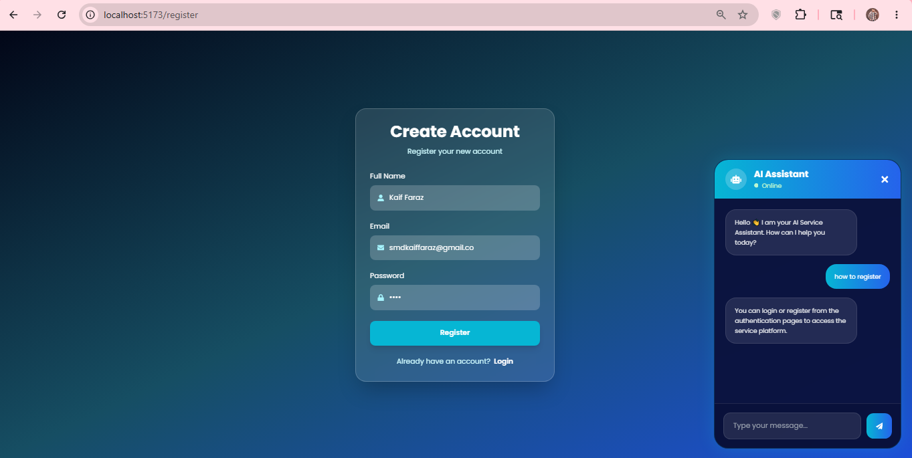

---

## 2️⃣ Login Page

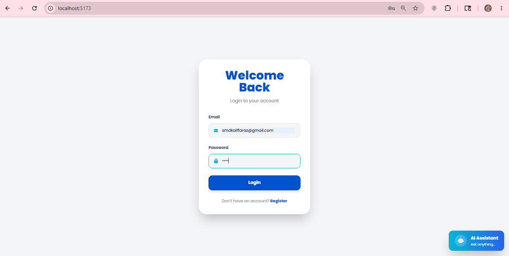

---

## 3️⃣ Dashboard Page

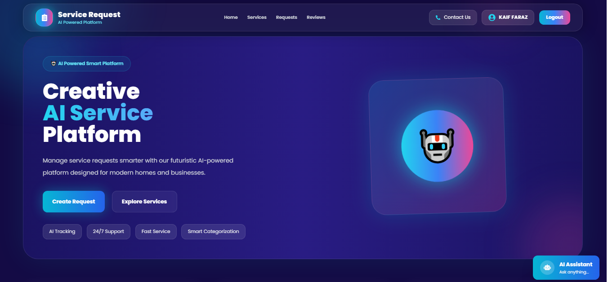

---

## 4️⃣ Create Service Request

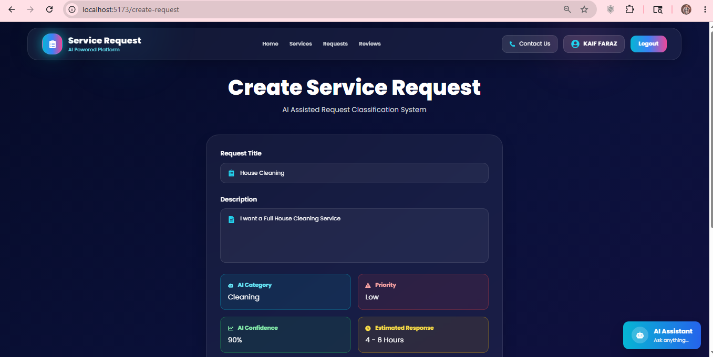


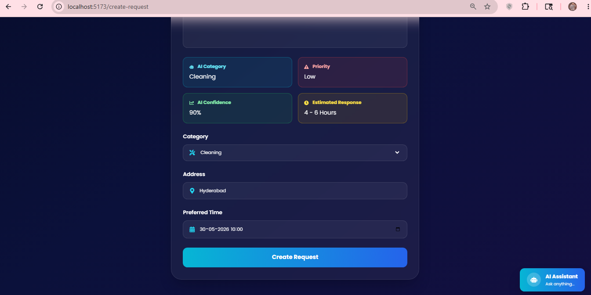

---

## 5️⃣ Service Categories

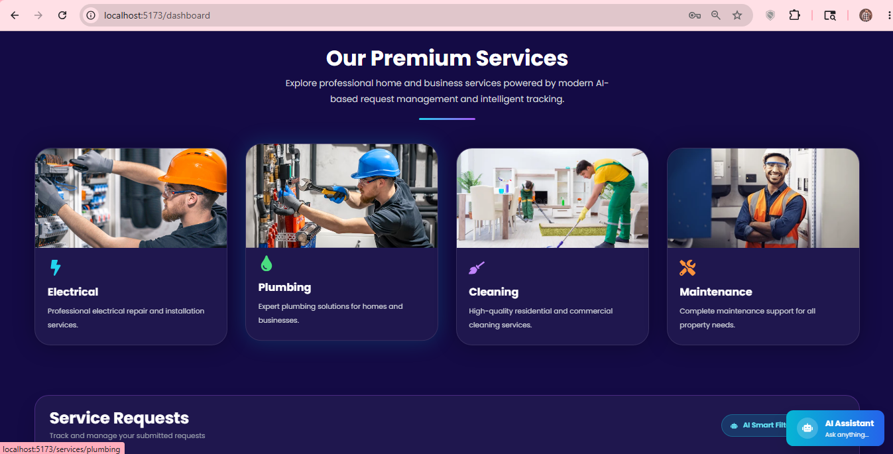


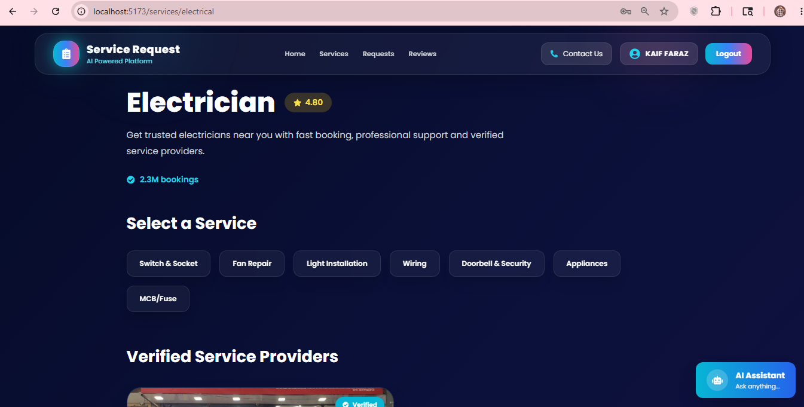


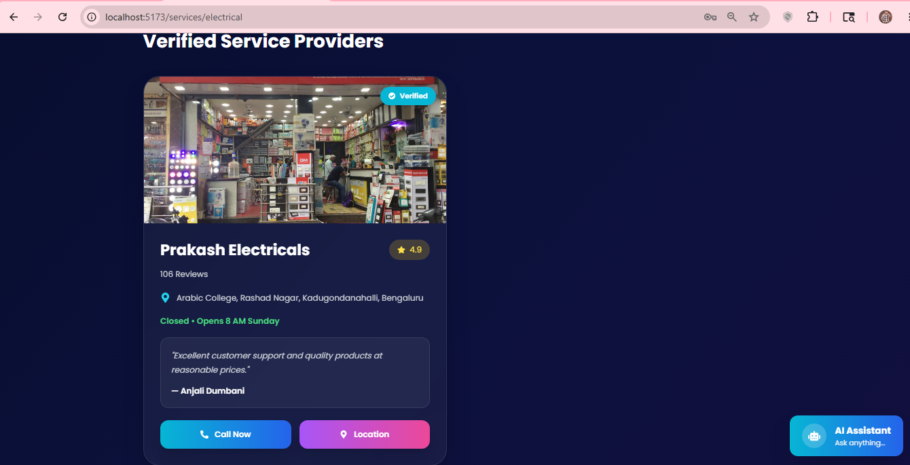


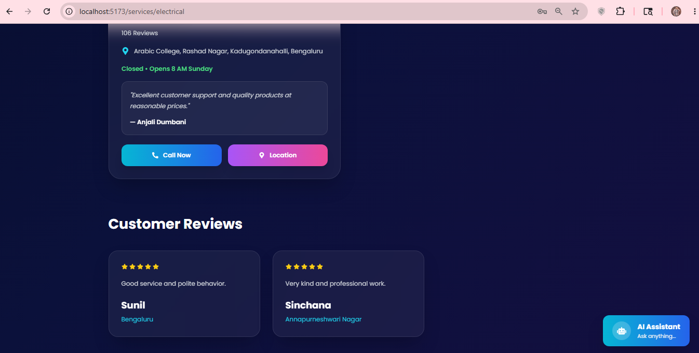

---

## 6️⃣ Request Tracking

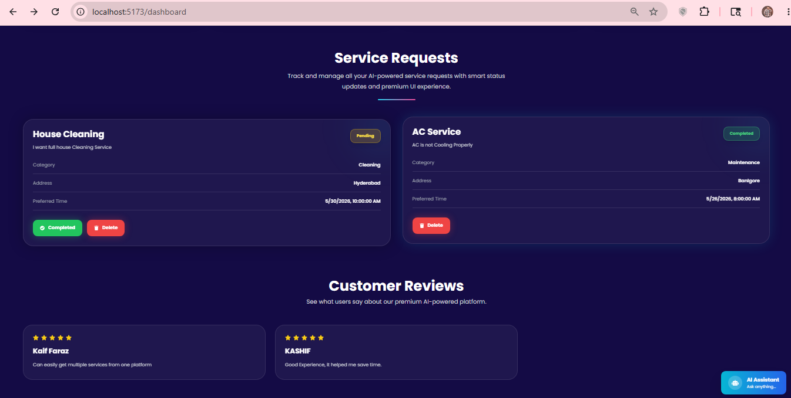

---

##  7️⃣ Customer Reviews Section

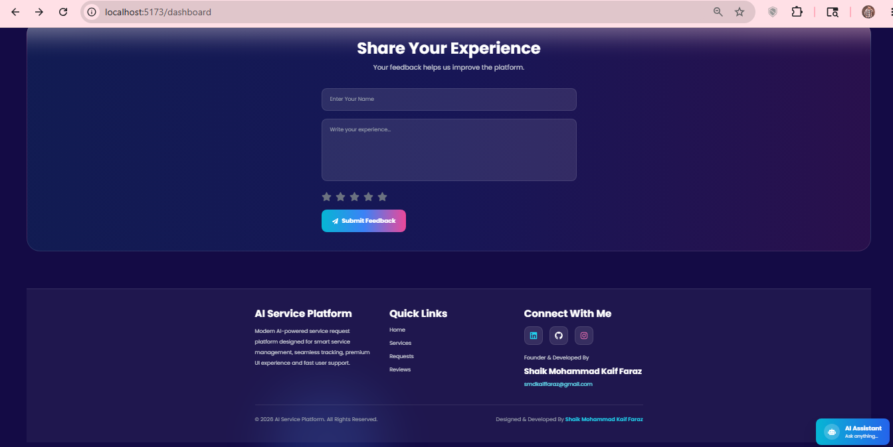

---

##  8️⃣ AI Assistant Chatbot

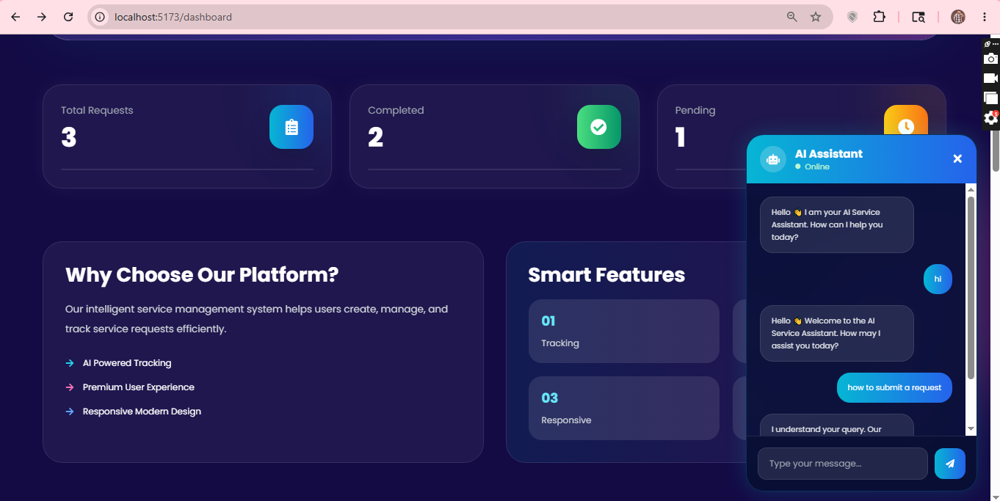

---


## 9️⃣ MySQL Database Tables

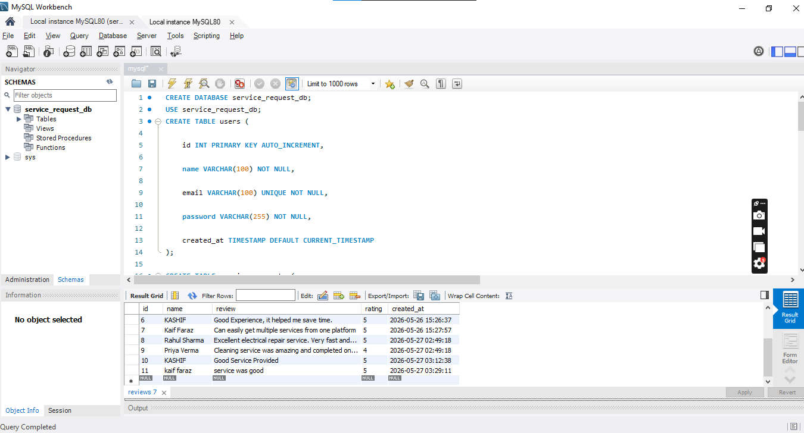

---


# 🎥 Project Demo Video

## Google Drive Demo Link

[Watch Project Demo Video](https://drive.google.com/file/d/1EGRfNQ_GjiMsnxF_73VOig0genfrZ2yp/view?usp=drive_link)

---


```
